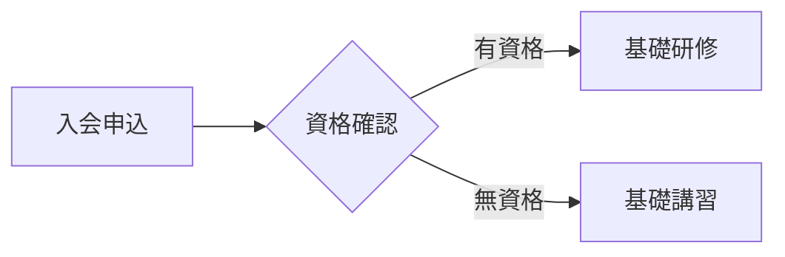
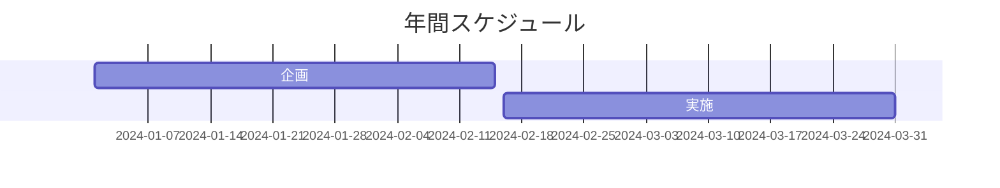
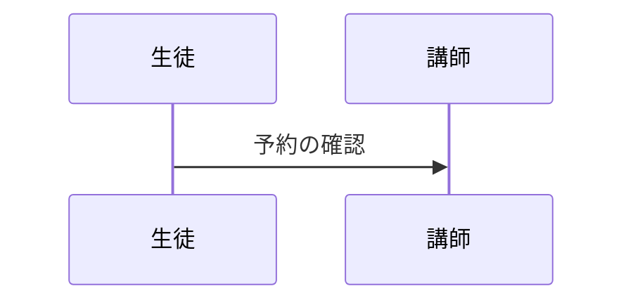
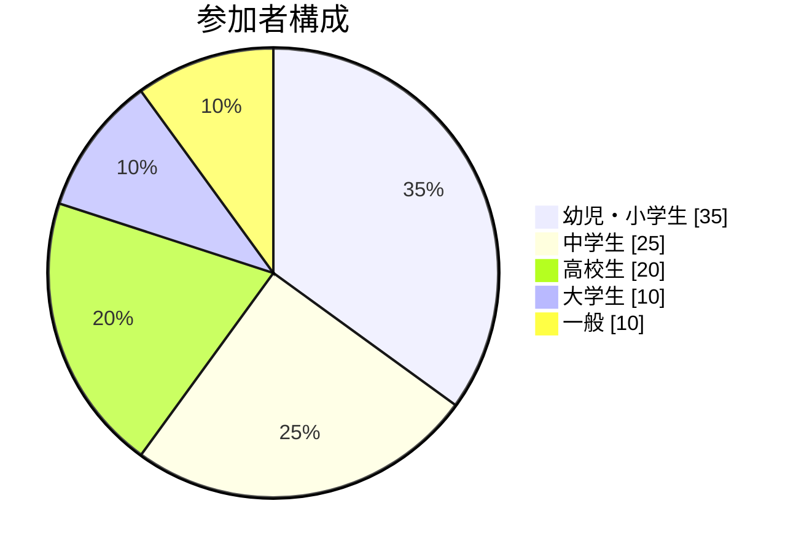

# PTNA Theme for Slidev

全日本ピアノ指導者協会（PTNA）公式Slidevテーマです。

## 特徴

- **PTNAブランドカラー**: メインカラー #770000（深紅）を基調としたエレガントなデザイン
- **音楽的な要素**: 音符や五線譜などの音楽モチーフを随所に配置
- **日本語フォント対応**: ヒラギノ角ゴシック等の日本語フォントに最適化
- **多様なレイアウト**: プレゼンテーション用途に応じたレイアウトを多数用意（`cover`/`default`/`section`/`intro`/`fact`/`quote`/`statement`/`two-cols`/`center`/`table-of-contents`）
- **レスポンシブデザイン**: デスクトップ・モバイル両対応

## レイアウト一覧

### `cover`

カバーページ用レイアウト。背景画像やグラデーションに対応し、音楽的な装飾要素を含みます。

### `default`

標準的なコンテンツページ用レイアウト。ページ番号表示機能付き。

### `section`

セクション区切り用レイアウト。大きなタイトルと装飾的な音楽要素でインパクトを演出。

### `intro`

導入ページ用レイアウト。下部にピアノ鍵盤パターンの装飾。

### `fact`

重要な数値や事実を強調表示するレイアウト。アニメーション付き音符装飾。

### `quote`

引用文表示用レイアウト。五線譜と引用符を組み合わせた装飾。

### `statement`

重要な宣言や声明用レイアウト。エレガントな枠線と角の音符装飾。

### `two-cols`

2カラムレイアウト。中央の縦線に音符装飾付き。

### `center`

中央配置レイアウト。背景に控えめな音符パターン。

### `table-of-contents`

目次レイアウト。各項目の左に黒丸白字の連番バッジを自動表示し、マルチカラムにも対応します。

## 使用方法

### インストール

```bash
npm install @slidev/theme-ptna
```

対応バージョン: Slidev v0.47 以上

### 基本設定

スライドファイル（`slides.md`）の冒頭に以下を追加：

```yaml
---
theme: ptna # or '@slidev/theme-ptna'
highlighter: shiki
lineNumbers: false
info: |
  ## PTNAプレゼンテーション
  全日本ピアノ指導者協会のスライドテーマ
drawings:
  persist: false
transition: slide-left
---
```

### レイアウトの使用例

```markdown
---
layout: cover
background: https://example.com/image.jpg
---

# タイトル

## サブタイトル

---

## layout: section

# セクションタイトル

---

## layout: default

# 通常のコンテンツ

内容をここに記載...
```

## カスタマイズ

### CSS変数

以下のCSS変数を使用してカスタマイズできます：

```css
:root {
  --ptna-primary: #770000; /* メインカラー */
  --ptna-primary-light: #aa0000; /* ライトカラー */
  --ptna-primary-dark: #550000; /* ダークカラー */
  --ptna-secondary: #ffffff; /* セカンダリカラー */
  --ptna-accent: #000000; /* アクセントカラー */
  --ptna-gray: #666666; /* グレー */
}
```

### フォント設定

デフォルトで日本語フォントが設定されていますが、`slidev`設定でカスタマイズ可能：

```yaml
---
theme: ptna
fonts:
  sans: "Hiragino Kaku Gothic ProN, Yu Gothic UI, sans-serif"
  serif: "Hiragino Mincho ProN, Yu Mincho, serif"
  mono: "Fira Code, monospace"
---
```

## 目次レイアウト（table-of-contents）

各スライドに応じて柔軟に目次を生成します。連番バッジは自動付与（1始まり）され、列をまたぐ箇所でも見切れにくいよう最適化しています。

最小構成

```md
---
layout: table-of-contents
---
```

主なプロパティ（frontmatter）

- `columns`: 列数（デフォルト: 1）。例: `columns: 2`
- `maxDepth`: 取得する見出しの最大レベル。例: `maxDepth: 2`
- `minDepth`: 取得する見出しの最小レベル。例: `minDepth: 1`
- `mode`: 取得対象。`all` | `onlyCurrentTree` | `onlySiblings`（デフォルト: `all`）
- `listClass`: 追加のクラスをリストへ付与（スタイルを局所的に上書きしたい場合に使用）

カラム間隔をさらに広げたい場合（例）

```html
<style>
  .slidev-layout.table-of-contents :deep(.ptna-toc-list[style*="column"]) {
    column-gap: 6rem; /* Safari 対応なら -webkit-column-gap も */
  }
</style>
```

番号バッジを隠したい場合（例）

```html
<style>
  .slidev-layout.table-of-contents :deep(.ptna-toc-list > li::before) {
    display: none;
  }
</style>
```

ヘッダーの差し替え

```md
---
layout: table-of-contents
---

::title::

# この発表の流れ

::

任意の説明文をここに入れられます。
```

備考

- カラム切り替わり時の見切れを抑制するため、リスト項目は分割されにくいスタイルになっています。
- ネストされた見出しは左ラインのみのシンプル表示（トップレベルに連番）。

## ECharts チャートコンポーネント

本テーマには、データ可視化のための ECharts 統合機能が含まれています。5種類の主要なチャートコンポーネントを利用できます。

### 利用可能なチャート

- **BarChart**: 棒グラフ（縦棒・横棒）
- **LineChart**: 折れ線グラフ（エリアチャート対応）
- **PieChart**: 円グラフ（ドーナツチャート、ローズチャート対応）
- **ScatterChart**: 散布図
- **RadarChart**: レーダーチャート

### 基本的な使い方

```vue
<script setup>
import { BarChart, LineChart, PieChart, ScatterChart, RadarChart } from 'slidev-theme-ptna/components/charts';
</script>

<div class="h-80">
  <BarChart
    title="年間売上"
    :labels="['2022年', '2023年', '2024年']"
    :series="[
      { name: '製品A', data: [120, 200, 150] },
      { name: '製品B', data: [80, 90, 110] }
    ]"
    x-axis-name="年度"
    y-axis-name="売上（百万円）"
  />
</div>
```

### チャートの高さ設定

チャートはコンテナの高さに自動的に適応します。Tailwind CSS のクラスを使用して高さを設定してください：

- `h-64`: 256px
- `h-80`: 320px  
- `h-96`: 384px

### アニメーション対応

Slidev の v-click ディレクティブと組み合わせて、動的なデータ更新が可能です：

```vue
<div class="h-80" v-click>
  <LineChart
    title="動的データ"
    :labels="['Jan', 'Feb', 'Mar']"
    :series="[{ 
      name: 'データ', 
      data: $slidev.nav.clicks > 0 ? [100, 150, 200] : [50, 60, 70]
    }]"
  />
</div>
```

### 複数チャートの配置

グリッドレイアウトを使用して複数のチャートを配置できます：

```vue
<div class="grid grid-cols-2 gap-4">
  <div class="h-64">
    <BarChart ... />
  </div>
  <div class="h-64">
    <PieChart ... />
  </div>
</div>
```

## Mermaid 図表の利用

本テーマは Slidev の Mermaid 対応を前提にそのまま利用できます。コードブロックに `mermaid` を指定してください。

フローチャート例



ガントチャート例



シーケンス図例



円グラフ（pieChart）例



## 開発

### ローカル開発

```bash
git clone <repository-url>
cd slidev-theme-ptna
npm install
npm run dev
```

ローカルテーマとして試す（このリポジトリ直下の `theme-ptna/example.md` を開くか、別の Slidev プロジェクトで `theme: ./` を指定）

### ビルド

```bash
npm run build
```

### プレビュー

```bash
npm run preview
```
