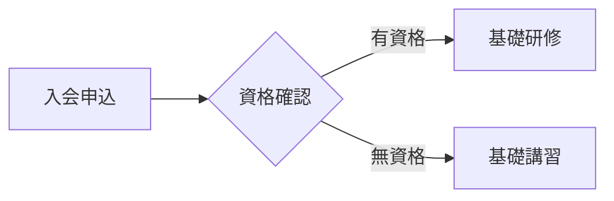
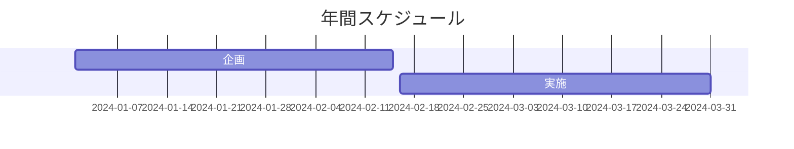
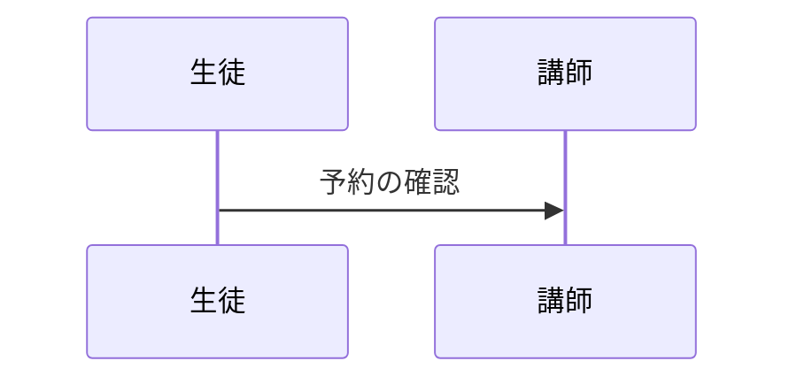
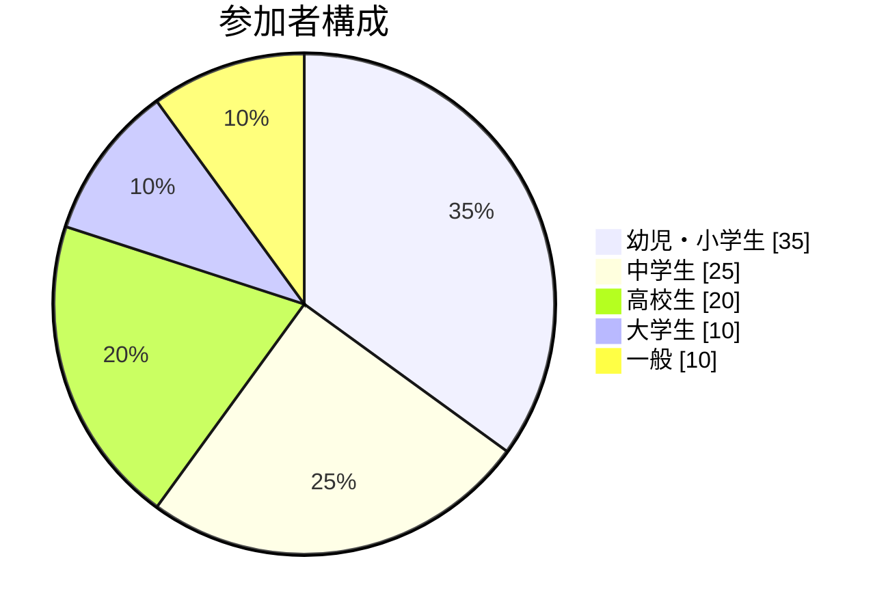

# PTNA Theme for Slidev

全日本ピアノ指導者協会（PTNA）公式Slidevテーマです。

## 特徴

- **PTNAブランドカラー**: メインカラー #770000（深紅）を基調としたエレガントなデザイン
- **音楽的な要素**: 音符や五線譜などの音楽モチーフを随所に配置
- **日本語フォント対応**: ヒラギノ角ゴシック等の日本語フォントに最適化
- **多様なレイアウト**: プレゼンテーション用途に応じたレイアウトを多数用意（`cover`/`default`/`section`/`intro`/`fact`/`quote`/`statement`/`two-cols`/`center`/`table-of-contents`）
- **レスポンシブデザイン**: デスクトップ・モバイル両対応

## レイアウト一覧

### `cover`

カバーページ用レイアウト。背景画像やグラデーションに対応し、音楽的な装飾要素を含みます。

### `default`

標準的なコンテンツページ用レイアウト。ページ番号表示機能付き。

### `section`

セクション区切り用レイアウト。大きなタイトルと装飾的な音楽要素でインパクトを演出。

### `intro`

導入ページ用レイアウト。下部にピアノ鍵盤パターンの装飾。

### `fact`

重要な数値や事実を強調表示するレイアウト。アニメーション付き音符装飾。

### `quote`

引用文表示用レイアウト。五線譜と引用符を組み合わせた装飾。

### `statement`

重要な宣言や声明用レイアウト。エレガントな枠線と角の音符装飾。

### `two-cols`

2カラムレイアウト。中央の縦線に音符装飾付き。

### `center`

中央配置レイアウト。背景に控えめな音符パターン。

### `table-of-contents`

目次レイアウト。各項目の左に黒丸白字の連番バッジを自動表示し、マルチカラムにも対応します。

## 使用方法

### インストール

```bash
npm install @slidev/theme-ptna
```

対応バージョン: Slidev v0.47 以上

### 基本設定

スライドファイル（`slides.md`）の冒頭に以下を追加：

```yaml
---
theme: ptna # or '@slidev/theme-ptna'
highlighter: shiki
lineNumbers: false
info: |
  ## PTNAプレゼンテーション
  全日本ピアノ指導者協会のスライドテーマ
drawings:
  persist: false
transition: slide-left
---
```

### レイアウトの使用例

```markdown
---
layout: cover
background: https://example.com/image.jpg
---

# タイトル

## サブタイトル

---

## layout: section

# セクションタイトル

---

## layout: default

# 通常のコンテンツ

内容をここに記載...
```

## カスタマイズ

### CSS変数

以下のCSS変数を使用してカスタマイズできます：

```css
:root {
  --ptna-primary: #770000; /* メインカラー */
  --ptna-primary-light: #aa0000; /* ライトカラー */
  --ptna-primary-dark: #550000; /* ダークカラー */
  --ptna-secondary: #ffffff; /* セカンダリカラー */
  --ptna-accent: #000000; /* アクセントカラー */
  --ptna-gray: #666666; /* グレー */
}
```

### フォント設定

デフォルトで日本語フォントが設定されていますが、`slidev`設定でカスタマイズ可能：

```yaml
---
theme: ptna
fonts:
  sans: "Hiragino Kaku Gothic ProN, Yu Gothic UI, sans-serif"
  serif: "Hiragino Mincho ProN, Yu Mincho, serif"
  mono: "Fira Code, monospace"
---
```

## 目次レイアウト（table-of-contents）

各スライドに応じて柔軟に目次を生成します。連番バッジは自動付与（1始まり）され、列をまたぐ箇所でも見切れにくいよう最適化しています。

最小構成

```md
---
layout: table-of-contents
---
```

主なプロパティ（frontmatter）

- `columns`: 列数（デフォルト: 1）。例: `columns: 2`
- `maxDepth`: 取得する見出しの最大レベル。例: `maxDepth: 2`
- `minDepth`: 取得する見出しの最小レベル。例: `minDepth: 1`
- `mode`: 取得対象。`all` | `onlyCurrentTree` | `onlySiblings`（デフォルト: `all`）
- `listClass`: 追加のクラスをリストへ付与（スタイルを局所的に上書きしたい場合に使用）

カラム間隔をさらに広げたい場合（例）

```html
<style>
  .slidev-layout.table-of-contents :deep(.ptna-toc-list[style*="column"]) {
    column-gap: 6rem; /* Safari 対応なら -webkit-column-gap も */
  }
</style>
```

番号バッジを隠したい場合（例）

```html
<style>
  .slidev-layout.table-of-contents :deep(.ptna-toc-list > li::before) {
    display: none;
  }
</style>
```

ヘッダーの差し替え

```md
---
layout: table-of-contents
---

::title::

# この発表の流れ

::

任意の説明文をここに入れられます。
```

備考

- カラム切り替わり時の見切れを抑制するため、リスト項目は分割されにくいスタイルになっています。
- ネストされた見出しは左ラインのみのシンプル表示（トップレベルに連番）。

## ECharts チャートコンポーネント

本テーマには、データ可視化のための ECharts 統合機能が含まれています。10種類の主要なチャートコンポーネントと、カスタムチャート用のベースコンポーネントを利用できます。

### 利用可能なチャート

- **BarChart**: 棒グラフ（縦棒・横棒）
- **LineChart**: 折れ線グラフ（エリアチャート対応）
- **PieChart**: 円グラフ（ドーナツチャート、ローズチャート対応）
- **ScatterChart**: 散布図
- **RadarChart**: レーダーチャート
- **FunnelChart**: ファネルチャート（コンバージョン分析）
- **WaterfallChart**: ウォーターフォールチャート（累積変化分析）
- **RaceChart**: レースチャート（動的ランキング）
- **SankeyChart**: サンキー図（フローの可視化）
- **TreeChart**: ツリー図（階層構造の可視化）

### 基本的な使い方

```vue
<script setup>
import { BarChart, LineChart, PieChart, ScatterChart, RadarChart, FunnelChart, WaterfallChart, RaceChart, SankeyChart, TreeChart } from 'slidev-theme-ptna/components/charts';
</script>

<div class="h-80">
  <BarChart
    :key="$slidev.nav.currentPage"
    title="年間売上"
    :labels="['2022年', '2023年', '2024年']"
    :series="[
      { name: '製品A', data: [120, 200, 150] },
      { name: '製品B', data: [80, 90, 110] }
    ]"
    x-axis-name="年度"
    y-axis-name="売上（百万円）"
  />
</div>
```

**重要**: スライド切り替え時にアニメーションを再生するには、`:key="$slidev.nav.currentPage"`を追加してください。

### 各チャートの詳細な使い方

#### BarChart（棒グラフ）

```vue
<BarChart
  :key="$slidev.nav.currentPage"
  title="タイトル"
  :labels="['ラベル1', 'ラベル2', 'ラベル3']"
  :series="[
    { name: 'シリーズ1', data: [100, 120, 90] },
    { name: 'シリーズ2', data: [80, 100, 110], stack: 'グループ1' }, // stack で積み上げ
  ]"
  x-axis-name="X軸ラベル"
  y-axis-name="Y軸ラベル"
  :horizontal="false"  // true で横棒グラフ
/>
```

#### LineChart（折れ線グラフ）

```vue
<LineChart
  :key="$slidev.nav.currentPage"
  title="月次推移"
  :labels="['1月', '2月', '3月', '4月', '5月', '6月']"
  :series="[
    { 
      name: 'データ1', 
      data: [120, 132, 101, 134, 90, 230],
      smooth: true,  // 曲線にする
      areaStyle: {}  // エリアチャートにする
    },
    { 
      name: 'データ2', 
      data: [220, 182, 191, 234, 290, 330],
      smooth: false
    }
  ]"
/>
```

#### PieChart（円グラフ）

```vue
<PieChart
  :key="$slidev.nav.currentPage"
  title="割合表示"
  :data="[
    { value: 335, name: 'カテゴリA' },
    { value: 310, name: 'カテゴリB' },
    { value: 234, name: 'カテゴリC' },
    { value: 135, name: 'カテゴリD' }
  ]"
  :show-legend="true"  // 凡例の表示/非表示
  :radius="'60%'"      // 半径（文字列または配列）
  :rose-type="false"   // 'radius' | 'area' | false でローズチャート
/>
```

#### ScatterChart（散布図）

```vue
<ScatterChart
  :key="$slidev.nav.currentPage"
  title="相関分析"
  :series="[
    {
      name: 'グループA',
      data: [[10, 8.04], [8, 6.95], [13, 7.58], [9, 8.81]], // [x, y]の配列
      symbolSize: 20  // 点のサイズ
    },
    {
      name: 'グループB',
      data: [[10, 9.14], [8, 8.14], [13, 8.74], [9, 8.77]],
      symbolSize: 15
    }
  ]"
  x-axis-name="X軸（独立変数）"
  y-axis-name="Y軸（従属変数）"
/>
```

#### RadarChart（レーダーチャート）

```vue
<RadarChart
  :key="$slidev.nav.currentPage"
  title="総合評価"
  :indicators="[
    { name: '指標1', max: 100 },
    { name: '指標2', max: 100 },
    { name: '指標3', max: 100 },
    { name: '指標4', max: 100 },
    { name: '指標5', max: 100 }
  ]"
  :data="[
    { 
      name: '現在', 
      value: [80, 90, 70, 85, 75],
      areaStyle: { opacity: 0.5 }  // 塗りつぶし
    },
    { 
      name: '目標', 
      value: [90, 95, 85, 90, 85],
      areaStyle: { opacity: 0.3 }
    }
  ]"
  :shape="'polygon'"  // 'polygon' | 'circle'
/>
```

#### FunnelChart（ファネルチャート）

```vue
<FunnelChart
  :key="$slidev.nav.currentPage"
  title="コンバージョンファネル"
  :data="[
    { value: 100, name: '訪問' },
    { value: 80, name: 'クリック' },
    { value: 60, name: '閲覧' },
    { value: 40, name: '問い合わせ' },
    { value: 20, name: '購入' }
  ]"
  :sort="'descending'"     // 'ascending' | 'descending' | 'none'
  :align="'center'"        // 'left' | 'center' | 'right'
  :gap="2"                 // 各段の間隔
  :min-size="'0%'"         // 最小サイズ
  :max-size="'100%'"       // 最大サイズ
  :show-legend="true"      // 凡例の表示/非表示
/>
```

#### WaterfallChart（ウォーターフォールチャート）

```vue
<WaterfallChart
  :key="$slidev.nav.currentPage"
  title="月次収支の推移"
  :data="[
    { name: '期初残高', value: 1000, type: 'total' },
    { name: '売上1', value: 450 },
    { name: '売上2', value: 380 },
    { name: '経費1', value: -220, type: 'expense' },  // 負の値またはtype: 'expense'
    { name: '売上3', value: 300 },
    { name: '経費2', value: -180, type: 'expense' },
    { name: '売上4', value: 250 },
  ]"
  :show-total="true"        // 最終合計の表示/非表示
  :positive-color="'#5cb85c'"  // プラス値の色
  :negative-color="'#d9534f'"  // マイナス値の色
/>
```

#### RaceChart（レースチャート）

動的にランキングが変化するアニメーションチャート。時系列データの順位変動を視覚的に表現します。

```vue
<RaceChart
  :key="$slidev.nav.currentPage"
  title="売上ランキングの推移"
  :data="[
    { 
      name: '製品A', 
      values: [
        { period: '2021年', value: 120 },
        { period: '2022年', value: 200 },
        { period: '2023年', value: 150 },
        { period: '2024年', value: 180 }
      ],
      color: '#5470c6'  // オプション：バーの色
    },
    { 
      name: '製品B', 
      values: [
        { period: '2021年', value: 80 },
        { period: '2022年', value: 90 },
        { period: '2023年', value: 110 },
        { period: '2024年', value: 140 }
      ],
      color: '#91cc75'
    }
    // ... 他の製品データ
  ]"
  unit="百万円"           // 単位表示
  :max-bars="10"         // 最大表示バー数
  :update-frequency="1500"  // アニメーション速度（ミリ秒）
  :auto-play="true"      // 自動再生
/>
```

**特徴：**
- 時系列データを自動的にアニメーション表示
- 各期間での順位が動的に変化
- 現在の期間を右下に大きく表示
- 自動再生と手動コントロールの切り替え可能

#### SankeyChart（サンキー図）

ノード間のフローや関係性を視覚的に表現するチャート。エネルギーフロー、プロセスフロー、資金の流れなどの表現に適しています。

```vue
<SankeyChart
  :key="$slidev.nav.currentPage"
  title="エネルギーフロー"
  :nodes="[
    { name: '石炭' },
    { name: '天然ガス' },
    { name: '火力発電' },
    { name: '産業' },
    { name: '家庭' }
  ]"
  :links="[
    { source: '石炭', target: '火力発電', value: 150 },
    { source: '天然ガス', target: '火力発電', value: 120 },
    { source: '火力発電', target: '産業', value: 130 },
    { source: '火力発電', target: '家庭', value: 70 }
  ]"
  orient="horizontal"      // 'horizontal' | 'vertical'
  :node-width="20"         // ノードの幅
  :node-gap="8"            // ノード間の間隔
  :node-align="'justify'"  // 'justify' | 'left' | 'right'
  :show-labels="true"      // ラベルの表示/非表示
/>
```

**特徴：**
- ノード間の流量を幅で表現
- グラデーション効果で流れを視覚化
- ホバー時に詳細情報表示
- カスタマイズ可能なレイアウト方向

#### TreeChart（ツリー図）

階層構造データを木構造で視覚的に表現するチャート。組織図、ファイル構造、分類体系などの表現に適しています。

```vue
<TreeChart
  :key="$slidev.nav.currentPage"
  title="組織構造"
  :data="{
    name: 'CEO',
    children: [
      {
        name: 'CTO',
        children: [
          { name: '開発部', value: 10 },
          { name: '研究部', value: 5 }
        ]
      },
      {
        name: 'CFO',
        children: [
          { name: '経理部', value: 8 },
          { name: '財務部', value: 6 }
        ]
      }
    ]
  }"
  orient="TB"              // 'LR' | 'RL' | 'TB' | 'BT' | 'radial'
  layout="orthogonal"      // 'orthogonal' | 'radial'
  edge-shape="polyline"    // 'polyline' | 'curve'
  :symbol-size="7"         // ノードのサイズ
  :expand-and-collapse="true"  // 展開/折りたたみ機能
  :initial-tree-depth="2"  // 初期展開深度
  emphasis="descendant"    // 'none' | 'self' | 'series' | 'ancestor' | 'descendant'
/>
```

**特徴：**
- インタラクティブな展開/折りたたみ機能
- 多様なレイアウト方向（左右、上下、放射状）
- カスタマイズ可能なエッジ形状
- ホバー時の強調表示

### チャートの高さ設定

チャートはコンテナの高さに自動的に適応します。Tailwind CSS のクラスを使用して高さを設定してください：

- `h-64`: 256px
- `h-80`: 320px  
- `h-96`: 384px
- `h-full`: 親要素の100%

### アニメーション効果

各チャートには異なるアニメーション効果が設定されています：

- **BarChart**: `elasticOut` - 弾むような効果
- **LineChart**: `linear` - 滑らかな描画
- **PieChart**: `scale` - 拡大アニメーション
- **ScatterChart**: `backOut` - 跳ねるような効果
- **RadarChart**: `sinusoidalInOut` - 波のような動き
- **FunnelChart**: `expansion` - 拡張アニメーション
- **WaterfallChart**: `cubicOut` - キュービックアウト効果
- **RaceChart**: `linear` - スムーズな動的ランキングアニメーション
- **SankeyChart**: `cubicOut` - 流れるようなアニメーション
- **TreeChart**: `cubicOut` - 展開アニメーション

### 動的データ更新

Slidev の機能と組み合わせて、インタラクティブなチャートを作成できます：

```vue
<div class="h-80" v-click>
  <LineChart
    :key="$slidev.nav.currentPage"
    title="クリックで更新"
    :labels="['Jan', 'Feb', 'Mar', 'Apr', 'May']"
    :series="[{ 
      name: 'データ', 
      data: $slidev.nav.clicks > 0 ? [100, 180, 140, 200, 160] : [50, 60, 55, 70, 65],
      smooth: true,
      areaStyle: { opacity: 0.3 }
    }]"
  />
</div>
```

### 複数チャートの配置

グリッドレイアウトを使用して複数のチャートを配置できます：

```vue
<div class="grid grid-cols-2 gap-4">
  <div class="h-64">
    <BarChart 
      :key="$slidev.nav.currentPage + '_bar'"
      ... 
    />
  </div>
  <div class="h-64">
    <PieChart 
      :key="$slidev.nav.currentPage + '_pie'"
      ... 
    />
  </div>
</div>
```

### BaseChartで任意のEChartsオプションを使用

提供されているチャートコンポーネント以外の複雑なチャートが必要な場合、`BaseChart`を直接使用して、任意のEChartsオプションを渡すことができます：

```vue
<script setup>
import { BaseChart } from 'slidev-theme-ptna/components/charts';
</script>

<div class="h-80">
  <BaseChart
    :key="$slidev.nav.currentPage"
    :option="{
      // 任意のEChartsオプション
      title: { text: 'カスタムチャート' },
      series: [{
        type: 'gauge',  // ゲージチャートなど
        data: [{ value: 50, name: 'Progress' }]
      }]
    }"
  />
</div>
```

これにより、EChartsがサポートするすべてのチャートタイプ（ゲージ、ツリーマップ、サンキー図、グラフなど）を使用できます。

### トラブルシューティング

- **チャートが表示されない**: コンテナに高さを設定してください（例: `class="h-80"`）
- **アニメーションが再生されない**: `:key="$slidev.nav.currentPage"`を追加してください
- **複数チャートで同じアニメーション**: keyに識別子を追加（例: `:key="$slidev.nav.currentPage + '_chart1'"`）

## Mermaid 図表の利用

本テーマは Slidev の Mermaid 対応を前提にそのまま利用できます。コードブロックに `mermaid` を指定してください。

フローチャート例



ガントチャート例



シーケンス図例



円グラフ（pieChart）例



## 開発

### ローカル開発

```bash
git clone <repository-url>
cd slidev-theme-ptna
npm install
npm run dev
```

ローカルテーマとして試す（このリポジトリ直下の `theme-ptna/example.md` を開くか、別の Slidev プロジェクトで `theme: ./` を指定）

### ビルド

```bash
npm run build
```

### プレビュー

```bash
npm run preview
```
