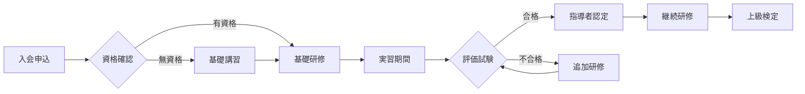
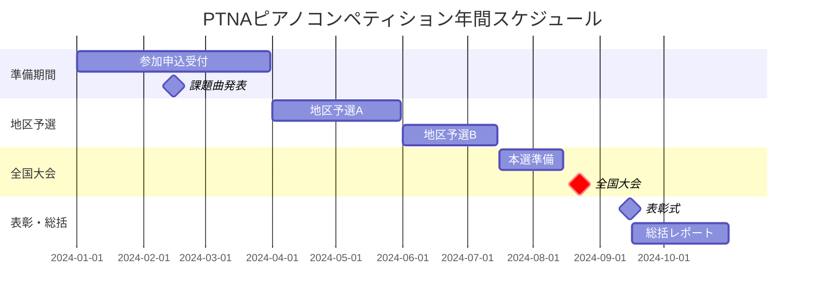
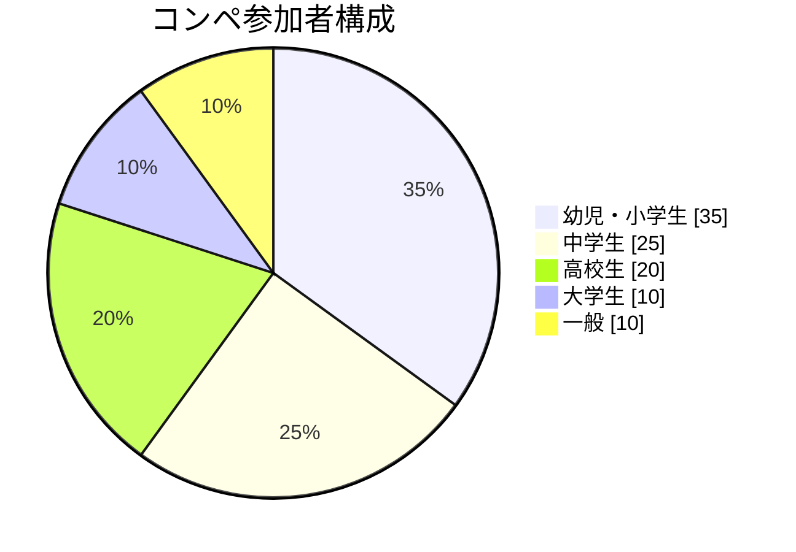
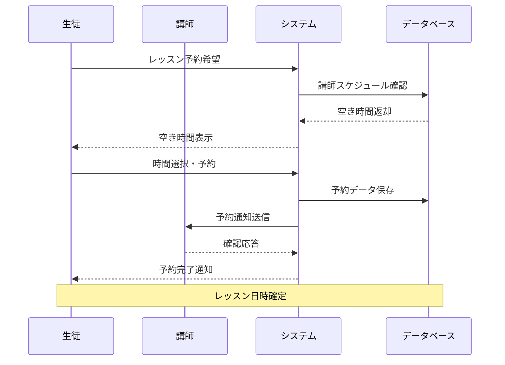

# ＜スライドタイトル＞

## ＜サブタイトル＞

＜本文＞

<div class="pt-20">
  <div class="text-3xl">
    <div class="mb-4">発表者: ＜発表者名＞</div>
    <div>日時: ＜発表日時＞</div>
  </div>
</div>

<div class="pt-12">
  <span @click="$slidev.nav.next" class="px-2 py-1 rounded cursor-pointer" hover="bg-white bg-opacity-10">
    プレゼンテーションを開始 <carbon:arrow-right class="inline"/>
  </span>
</div>

---
layout: table-of-contents
---

---
layout: intro
---

# はじめに

## PTNAについて

全日本ピアノ指導者協会（PTNA）は、ピアノ指導者の育成と音楽教育の発展を目的として設立された団体です。

- **設立年**: 1977年
- **会員数**: 約18,000名
- **支部数**: 全国300支部以上

私たちは音楽を通じて豊かな社会の実現を目指しています。

---
layout: section
---

# 活動内容

---
layout: default
hideInToc: true
---

# PTNAの主な活動

## 1. ピアノ指導者の育成

- **指導者検定**: 段階的なレベルアップ
- **指導法セミナー**: 最新の教授法を学習
- **海外研修**: 国際的な視野を養成

## 2. コンペティション運営

- **ピアノコンペティション**: 年1回開催
- **ステップ**: 継続学習を支援
- **コンクール**: 技術向上の機会

## 3. 音楽文化の普及

出版活動、コンサート企画、地域との連携を通じて音楽文化の発展に貢献

---
layout: two-cols
---

# 教育システム

PTNAの体系的な教育システムをご紹介します。

::left::

## 基礎教育

- 楽典・和声学
- 演奏技術の基礎
- 音楽理論
- 音楽史
- アナリーゼ

## 指導法研究

- 年齢別指導法
- レベル別カリキュラム
- 発達心理学

::right::

## 実践指導

- レッスン見学
- 模擬レッスン
- 現場実習
- 指導案作成

## 資格取得

- 指導者ライセンス
- コンペティション審査員
- ステップアドバイザー

---
layout: fact
hideInToc: true
---

# 77

設立から**47年**の歴史

---
layout: quote
hideInToc: true
---

# "音楽は人生を豊かにする最高の贈り物である"

_— PTNA創設者の言葉_

---
layout: statement
hideInToc: true
---

# 音楽教育の未来を共に創造しましょう

---
layout: center
class: text-center
hideInToc: true
---

# コードサンプル

```typescript {all|2|1-6|9|all}
interface PianoLesson {
  student: string;
  duration: number;
  level: "beginner" | "intermediate" | "advanced";
}

class PTNAInstructor {
  private lessons: PianoLesson[] = [];

  scheduleLesson(lesson: PianoLesson): void {
    this.lessons.push(lesson);
  }

  getTotalHours(): number {
    return this.lessons.reduce((sum, lesson) => sum + lesson.duration, 0);
  }
}
```

---
layout: default
hideInToc: true
---

# YouTubeコンポーネントの例

Slidevでは、built-inのYouTubeコンポーネントを使用して動画を簡単に埋め込むことができます。

## 基本的な使用方法

<Youtube id="qTlTMRryo5I" width="480" height="270" />

## カスタムサイズでの表示

<Youtube id="qTlTMRryo5I" width="400" height="225" />

## 特定の時間から開始

特定の時間から動画を開始したい場合は、IDに`?start=秒数`を追加できます：

```markdown
<Youtube id="qTlTMRryo5I?start=30" />
```

## コード例

```markdown
<!-- 基本使用法（推奨サイズ） -->
<Youtube id="動画ID" width="480" height="270" />

<!-- 小さめサイズ -->
<Youtube id="動画ID" width="400" height="225" />

<!-- 開始時間指定 -->
<Youtube id="動画ID?start=30" width="480" height="270" />
```

---
layout: default
hideInToc: true
---

# 表の例

| 級位     | レベル | 課題曲数 | 試験時間 |
| -------- | ------ | -------- | -------- |
| 指導者級 | 最上級 | 10曲     | 60分     |
| 上級     | 上級   | 8曲      | 50分     |
| 中級     | 中級   | 6曲      | 40分     |
| 初級     | 初級   | 4曲      | 30分     |

## リスト例

1. **基礎練習**
   - スケール練習
   - アルペジオ練習
   - エチュード

2. **楽曲演奏**
   - バロック音楽
   - 古典派音楽
   - ロマン派音楽
   - 近現代音楽

---
layout: default
---

# Mermaid ダイアグラムの例

ピアノ教育のプロセスをMermaidダイアグラムで可視化できます。

## 指導者育成フロー



---
layout: default
hideInToc: true
---

# Mermaid ガントチャートの例

## 年間活動スケジュール



---
layout: default
hideInToc: true
---

# Mermaid 円グラフの例

## 参加者構成



---
layout: default
hideInToc: true
---

# Mermaid シーケンス図の例

## レッスン予約システム



---
layout: image-left
image: https://ptnyan-assets.s3.ap-northeast-1.amazonaws.com/public/filemaker/1000283.png
hideInToc: true
---

# 画像とテキストのレイアウト例

このレイアウトでは、画像とテキストを効果的に組み合わせて表示できます。

## 主な特徴

- **自動画像配置**: imageプロパティで簡単に画像を指定
- **位置選択**: 左右どちらにも配置可能
- **レスポンシブ対応**: モバイルデバイスで最適化
- **PTNAテーマ**: 音楽記号の装飾付き

画像は自動的にサイズ調整され、美しく表示されます。

---
layout: image-right
image: https://ptnyan-assets.s3.ap-northeast-1.amazonaws.com/public/filemaker/1000283.png
imagePosition: left
hideInToc: true
---

# 画像を左側に配置

`imagePosition: left` を指定することで、画像を左側に配置できます。

## 使用方法

```markdown
---
layout: image-text
image: /path/to/your/image.jpg
imagePosition: left
---

# タイトル

ここにテキスト内容を記述します。
```

テキストの内容に応じて、画像の位置を柔軟に調整できます。

---
layout: timeline
animate: true
hideInToc: true
---

<template v-slot:title>

# PTNAの歴史

</template>

## 1977年

全日本ピアノ指導者協会（PTNA）設立

## 1980年

第1回ピティナ・ピアノコンペティション開催

## 1990年

指導者育成プログラム開始

## 2000年

ピアノステップ事業開始

## 2010年

会員数1万人突破

## 2024年

創立47周年を迎える

---
layout: comparison
leftTitle: 従来の指導法
rightTitle: PTNAメソッド
highlight: right
hideInToc: true
---

::title::

# 指導法の比較

::left::

- 画一的なカリキュラム
- 技術重視の指導
- 固定的な評価基準
- 限定的な発表機会

::right::

- 個別最適化されたカリキュラム
- 音楽性と技術のバランス
- 段階的な評価システム
- 豊富な演奏機会（ステップ・コンペ）

PTNAメソッドは、一人ひとりの成長に合わせた指導を実現します。

---
layout: profile
image: https://ptnyan-assets.s3.ap-northeast-1.amazonaws.com/public/filemaker/1000283.png
name: 山田太郎
hideInToc: true
title: ピアノ指導者
organization: PTNA正会員・指導者賞受賞
email: yamada@example.com
website: https://example.com
---

## プロフィール

東京音楽大学卒業後、ヨーロッパで研鑽を積む。帰国後はPTNA正会員として後進の指導にあたる。

### 指導実績

- コンペティション全国大会出場者多数輩出
- 指導者賞3年連続受賞
- ステップアドバイザー

### 専門分野

- 幼児期のピアノ導入指導
- コンクール対策
- 音楽理論・ソルフェージュ

---
layout: center
hideInToc: true
clicks: 5
---

# インタラクティブコンポーネント

<v-click>
<StepIndicator
  :steps="[
    { title: '入会申込', description: 'Webサイトから申込', completed: $clicks >= 2 },
    { title: '審査', description: '資格確認と承認', completed: $clicks >= 3 },
    { title: '研修受講', description: '基礎研修プログラム', completed: $clicks >= 4 },
    { title: '認定取得', description: '指導者ライセンス発行', completed: $clicks >= 5 }
  ]"
  :current="Math.min($clicks - 1, 3)"
  layout="horizontal"
/>
</v-click>

---
layout: table-of-contents
columns: 3
hideInToc: true
---

# Table of Contentsレイアウトの例

このレイアウトでは、Tocコンポーネントをラップして美しい目次ページを作成できます。

## 主な機能

- **カスタマイズ可能な表示**: columns、maxDepth、minDepthなどのプロパティ対応
- **PTNAテーマデザイン**: 音楽記号とテーマカラーを使用
- **レスポンシブ対応**: モバイルデバイスで最適化

---
layout: default
hideInToc: true
---

# Tocコンポーネントの使用方法

`hideInToc: true`を設定したこのページは目次に表示されません。

## 基本的な使用方法

```markdown
---
layout: table-of-contents
---

# 目次

プレゼンテーションの構成
```

## プロパティ例

```markdown
---
layout: table-of-contents
columns: 2
maxDepth: 2
minDepth: 1
mode: "all"
---
```

## hideInTocオプション

特定のスライドを目次に表示したくない場合：

```markdown
---
hideInToc: true
---
```

---
layout: two-cols-header
hideInToc: true
---

# 2カラムレイアウトの例

## 左右に分割されたコンテンツ

このレイアウトでは、左右に分割された2カラムのコンテンツを表示できます。

::left::

### 左カラム

- ポイント1
- ポイント2
- ポイント3

::right::

### 右カラム

- ポイントA
- ポイントB
- ポイントC

---
layout: image-two-cols
position: right
images:
  - https://ptnyan-assets.s3.ap-northeast-1.amazonaws.com/public/filemaker/1000283.png
  - https://ptnyan-assets.s3.ap-northeast-1.amazonaws.com/public/filemaker/1000284.png
  - https://ptnyan-assets.s3.ap-northeast-1.amazonaws.com/public/filemaker/1000285.png
hideInToc: true
---

# Image Two Cols

## 画像切り替え機能付き

このレイアウトは、コンテンツと画像を2カラムで表示し、複数の画像を切り替えることができます。

### 特徴

- **位置指定**: `position: right` または `position: left`で画像位置を指定
- **複数画像**: `images`配列で複数画像を指定
- **v-switch統合**: クリックで画像を切り替え
- **フルスクリーン画像**: 画像側は全面表示

### 使用例

```yaml
---
layout: image-two-cols
position: left
images:
  - /path/to/image1.jpg
  - /path/to/image2.jpg
---
```

---
layout: image-two-cols
position: left
images:
  - https://ptnyan-assets.s3.ap-northeast-1.amazonaws.com/public/filemaker/1000283.png
  - https://ptnyan-assets.s3.ap-northeast-1.amazonaws.com/public/filemaker/1000284.png
  - https://ptnyan-assets.s3.ap-northeast-1.amazonaws.com/public/filemaker/1000285.png
hideInToc: true
---

# 左側配置の例

## position: leftの使用

画像を左側に配置し、コンテンツを右側に表示します。

### ピアノ教育の革新

PTNAでは最新の教育メソッドを取り入れ、生徒一人ひとりの個性に合わせた指導を実現しています。

- **デジタルツール活用**: オンラインレッスン対応
- **個別カリキュラム**: 生徒の成長に合わせた指導計画
- **継続的な評価**: ステップによる段階的な成長確認

画像は複数設定でき、クリックで切り替えが可能です。

---
layout: end
---

# ありがとうございました

本日は貴重なお時間をいただき、誠にありがとうございました。

## 今後ともよろしくお願いいたします

PTNAは音楽教育の発展と指導者の育成に全力で取り組んでまいります。
