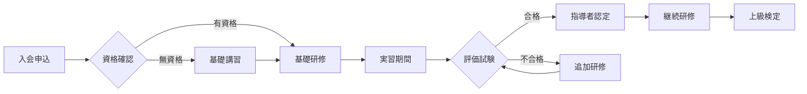
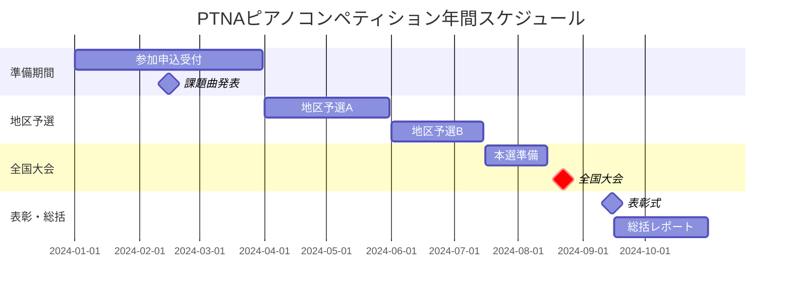
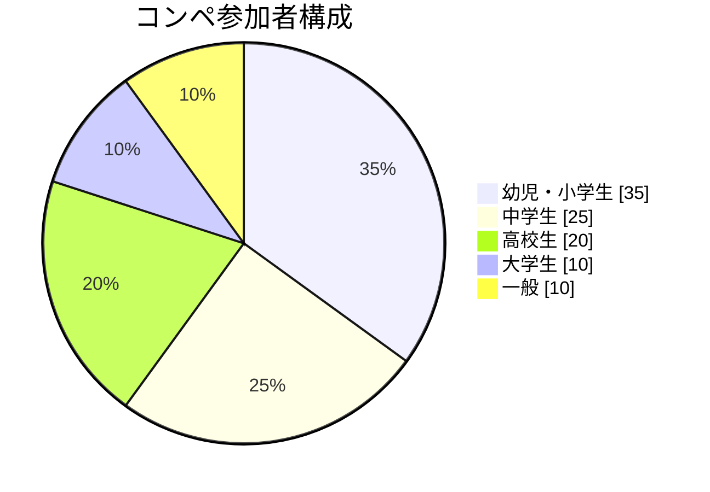
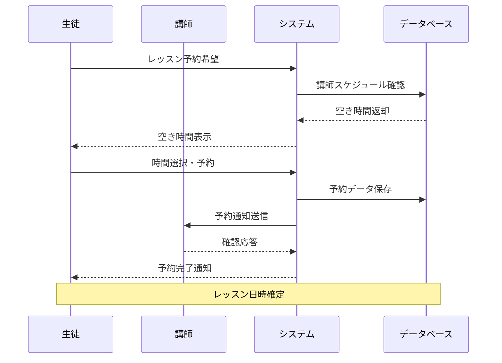

# ＜スライドタイトル＞
## ＜サブタイトル＞

＜本文＞

<div class="pt-20">
  <div class="text-3xl">
    <div class="mb-4">発表者: ＜発表者名＞</div>
    <div>日時: ＜発表日時＞</div>
  </div>
</div>

<div class="pt-12">
  <span @click="$slidev.nav.next" class="px-2 py-1 rounded cursor-pointer" hover="bg-white bg-opacity-10">
    プレゼンテーションを開始 <carbon:arrow-right class="inline"/>
  </span>
</div>


---
layout: intro
---

# はじめに
## PTNAについて

全日本ピアノ指導者協会（PTNA）は、ピアノ指導者の育成と音楽教育の発展を目的として設立された団体です。

- **設立年**: 1977年
- **会員数**: 約18,000名
- **支部数**: 全国300支部以上

私たちは音楽を通じて豊かな社会の実現を目指しています。

---
layout: section
---

# 活動内容

---
layout: default
---

# PTNAの主な活動

## 1. ピアノ指導者の育成

- **指導者検定**: 段階的なレベルアップ
- **指導法セミナー**: 最新の教授法を学習
- **海外研修**: 国際的な視野を養成

## 2. コンペティション運営

- **ピアノコンペティション**: 年1回開催
- **ステップ**: 継続学習を支援
- **コンクール**: 技術向上の機会

## 3. 音楽文化の普及

出版活動、コンサート企画、地域との連携を通じて音楽文化の発展に貢献

---
layout: two-cols
---

# 教育システム

PTNAの体系的な教育システムをご紹介します。

## 基礎教育
- 楽典・和声学
- 演奏技術の基礎
- 音楽理論

## 実践指導
- レッスン見学
- 模擬レッスン
- 現場実習

::right::

# 実績データ

<div class="text-center">

## 指導者検定合格者数
**累計 5,000名以上**

## コンペティション参加者
**年間 40,000名**

## ステップ参加者
**年間 50,000名**

## 会員満足度
**95%以上**

</div>

---
layout: fact
---

# 77
設立から**47年**の歴史

---
layout: quote
---

# "音楽は人生を豊かにする最高の贈り物である"
*— PTNA創設者の言葉*

---
layout: statement
---

# 音楽教育の未来を共に創造しましょう

---
layout: center
class: text-center
---

# コードサンプル

```typescript {all|2|1-6|9|all}
interface PianoLesson {
  student: string
  duration: number
  level: 'beginner' | 'intermediate' | 'advanced'
}

class PTNAInstructor {
  private lessons: PianoLesson[] = []
  
  scheduleLesson(lesson: PianoLesson): void {
    this.lessons.push(lesson)
  }
  
  getTotalHours(): number {
    return this.lessons.reduce((sum, lesson) => sum + lesson.duration, 0)
  }
}
```

---
layout: default
---

# 表の例

| 級位 | レベル | 課題曲数 | 試験時間 |
|------|-------|---------|---------|
| 指導者級 | 最上級 | 10曲 | 60分 |
| 上級 | 上級 | 8曲 | 50分 |
| 中級 | 中級 | 6曲 | 40分 |
| 初級 | 初級 | 4曲 | 30分 |

## リスト例

1. **基礎練習**
   - スケール練習
   - アルペジオ練習
   - エチュード

2. **楽曲演奏**
   - バロック音楽
   - 古典派音楽  
   - ロマン派音楽
   - 近現代音楽

---
layout: default
---

# Mermaid ダイアグラムの例

ピアノ教育のプロセスをMermaidダイアグラムで可視化できます。

## 指導者育成フロー



---
layout: default
---

# Mermaid ガントチャートの例

## 年間活動スケジュール



---
layout: default
---

# Mermaid 円グラフの例

## 参加者構成



---
layout: default
---

# Mermaid シーケンス図の例

## レッスン予約システム



---
layout: image-text
image: https://ptnyan-assets.s3.ap-northeast-1.amazonaws.com/public/filemaker/1000283.png
---

# 画像とテキストのレイアウト例

このレイアウトでは、画像とテキストを効果的に組み合わせて表示できます。

## 主な特徴

- **自動画像配置**: imageプロパティで簡単に画像を指定
- **位置選択**: 左右どちらにも配置可能
- **レスポンシブ対応**: モバイルデバイスで最適化
- **PTNAテーマ**: 音楽記号の装飾付き

画像は自動的にサイズ調整され、美しく表示されます。

---
layout: image-text
image: https://ptnyan-assets.s3.ap-northeast-1.amazonaws.com/public/filemaker/1000283.png
imagePosition: left
---

# 画像を左側に配置

`imagePosition: left` を指定することで、画像を左側に配置できます。

## 使用方法

```markdown
---
layout: image-text
image: /path/to/your/image.jpg
imagePosition: left
---

# タイトル
ここにテキスト内容を記述します。
```

テキストの内容に応じて、画像の位置を柔軟に調整できます。

---
layout: center
class: text-center
---

# お問い合わせ

[全日本ピアノ指導者協会](https://www.piano.or.jp)

<PoweredBySliddev mt-10 />
